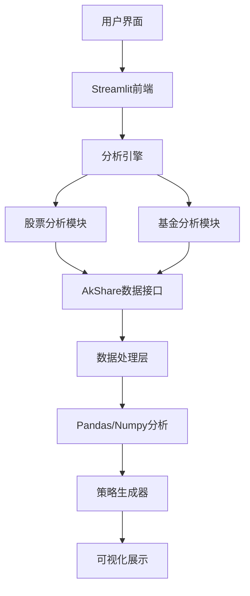

# 📈 智能投资分析系统

基于 Streamlit 构建的专业股票和基金分析平台，融合技术分析、量化评估与智能建议，为投资者提供科学的投资决策支持。

## 🌟 核心特色

### 🔍 多维度分析体系
- **技术面分析**: 趋势识别、相对强弱、支撑阻力位检测
- **基本面评估**: 基金业绩、风险收益、基金经理能力
- **量化策略**: 均线系统、突破信号、量价配合度分析
- **风险控制**: 最大回撤监控、夏普比率评估、仓位管理建议

### 🎯 智能投资建议
- 基于机器学习的趋势判断算法
- 多因子综合评分体系 (0-100分)
- 个性化仓位配置建议
- 具体的买卖时机指导
- 分批建仓和止损策略

## 🛠️ 技术架构



### 核心组件
- **数据层**: AkShare 实时金融数据获取
- **分析层**: Pandas/Numpy 科学计算引擎
- **策略层**: 自研量化分析算法
- **展示层**: Streamlit 交互式Web界面
- **缓存层**: 本地数据缓存优化性能

## 📊 功能详解

### 📈 股票分析模块

#### 技术指标体系
- **趋势分析**: 30周移动平均线趋势判断
- **相对强度**: 相对于沪深300指数的表现评估
- **突破检测**: 关键阻力位和支撑位识别
- **量价分析**: 成交量与价格变动的配合度分析
- **风险控制**: 止损位和目标位建议

#### 输出结果
```json
{
  "股票代码": "000001",
  "股票名称": "平安银行",
  "当前趋势": "上升趋势",
  "相对强度": 0.0234,
  "突破信号": "是",
  "投资建议": "买入",
  "投资评分": 85,
  "止损建议": 12.50
}
```

### 💰 基金分析模块

#### 多维度评估体系
- **趋势分析**: 均线斜率、R²拟合度、均线排列
- **相对强度**: 多周期(12/26/52周)超额收益分析
- **风险评估**: 最大回撤、下行波动率、夏普比率
- **业绩分析**: 年化收益率、胜率统计、风险调整后收益

#### 智能评分系统
```
综合评分 = 基础分数 + 增强因子 + 风险调整
- 基础分数: 基于趋势阶段(1-4阶段)
- 增强因子: 相对强度、年化收益、风险调整收益
- 风险调整: 回撤控制、夏普比率、买入时机
```

#### 交易策略生成
- **分批买入计划**: 根据评分制定仓位分配
- **止损位设置**: 基于技术位和风险容忍度
- **加仓减仓条件**: 动态调整策略
- **目标收益设定**: 风险收益平衡

## 🚀 快速开始

### 环境要求
- Python 3.8+
- 64位操作系统
- 稳定的网络连接

### 安装部署

#### 1. 克隆项目
```bash
git clone https://github.com/yourusername/fund-analysis.git
cd fund_analysis
```

#### 2. 创建虚拟环境
```bash
# Windows
python -m venv venv
venv\Scripts\activate

# macOS/Linux
python3 -m venv venv
source venv/bin/activate
```

#### 3. 安装依赖
```bash
pip install -r requirements.txt
```

#### 4. 启动应用
```bash
streamlit run streamlit_app.py --server.port 8881
```

访问地址: http://localhost:8881

### Docker部署 (可选)
```bash
# 构建镜像
docker build -t investment-analysis .

# 运行容器
docker run -p 8881:8881 investment-analysis
```

## 📖 使用指南

### 股票分析流程
1. 选择"股票分析"模式
2. 输入股票代码 (如: 000001, 600000)
3. 点击"开始分析"
4. 查看技术分析报告
5. 参考投资建议进行决策

### 基金分析流程
1. 选择"基金分析"模式
2. 输入基金代码 (如: 000001, 110011)
3. 可选择批量分析多个基金
4. 设置总投资金额进行资产配置建议
5. 查看综合评估报告

### 批量分析功能
```
输入示例: 000001,110011,000002
功能特点:
- 多基金同时分析对比
- 综合评分排序
- 资产配置建议
- 一键导出分析结果
```

## 🔧 配置说明

### 参数配置文件 (config.py)
```python
# 趋势分析参数
ANALYSIS_CONFIG = {
    'stock': {
        'relative_strength_period': 12,  # 相对强弱周期
        'breakout_period': 12,           # 突破检测周期
        'volume_threshold': 1.5,         # 量能阈值
    },
    'fund': {
        'benchmark_index': 'sh000300',   # 基准指数
        'analysis_years': 3,             # 分析年限
        'risk_free_rate': 0.03,          # 无风险利率
    }
}
```

### 自定义策略
可在 `advisor_stock.py` 和 `advisor_fund.py` 中调整:
- 趋势判断逻辑
- 评分权重分配
- 风险控制参数
- 交易策略规则
